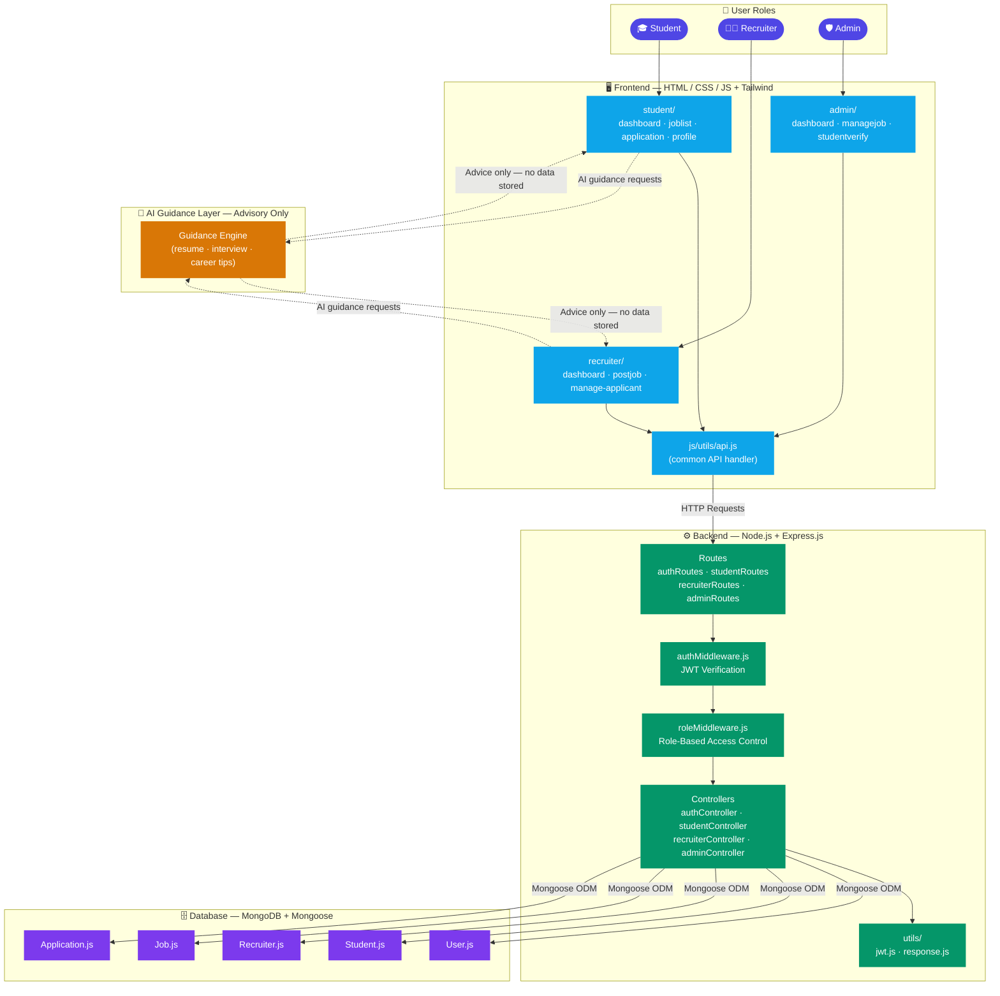

# 🏗️ PlacementorAI – Architecture Overview

This document explains how PlacementorAI's components fit together. It's written for new contributors who want to understand the system before diving into the code.

---

## 🗺️ System Architecture Diagram



---

## 🧱 Layer-by-Layer Breakdown

### 1. 👥 User Roles
Three distinct roles, each with a strictly scoped set of permissions:

| Role | Can Do | Cannot Do |
|---|---|---|
| **Student** | Apply to jobs, manage profile, get AI guidance | Update/delete applications |
| **Recruiter** | Post jobs, manage applicants, get AI guidance | Apply to jobs |
| **Admin** | Approve jobs, verify users, view metrics | Create or modify applications |

---

### 2. 🖥️ Frontend — `frontend/`
Plain HTML/CSS/JS with Tailwind CSS. Each role has its own folder with dedicated pages.

- **`index.html`** — Public landing page  
- **`login.html` / `register.html`** — Auth entry points  
- **`js/utils/api.js`** — Central fetch helper; all API calls go through here (attach JWT token, handle errors consistently)

---

### 3. ⚙️ Backend — `backend/`
Node.js + Express.js REST API. Every request passes through two middleware layers before reaching a controller.

**Request lifecycle:**
```
Route → authMiddleware (JWT check) → roleMiddleware (role check) → Controller → DB
```

- **`app.js`** — Mounts all routes and global middleware  
- **`server.js`** — Entry point, starts the HTTP server  
- **`config/db.js`** — MongoDB connection  
- **`utils/response.js`** — Standardised API response shape across all endpoints  

---

### 4. 🔐 Auth & Middleware — `middlewares/`
Two files, always used together:

| File | Purpose |
|---|---|
| `authMiddleware.js` | Verifies the JWT token on every protected route |
| `roleMiddleware.js` | Checks the decoded role matches the required role for that route |

Token utilities (sign, verify) live in `utils/jwt.js`.

---

### 5. 🗄️ Database — MongoDB + Mongoose — `models/`

| Model | Stores |
|---|---|
| `User.js` | Shared auth fields (email, password hash, role) |
| `Student.js` | CGPA, branch, skills, resume link |
| `Recruiter.js` | Company info, posted jobs |
| `Job.js` | Job details, approval status |
| `Application.js` | Student–Job link + status (Pending / Shortlisted / Rejected) |

---

### 6. 🤖 AI Guidance Layer
Advisory only — the AI never writes to the database or makes decisions.

- Provides resume tips, interview prep, and career advice to Students and Recruiters  
- Communicates only with the frontend; no backend routes are involved  
- Cannot log users in, apply to jobs, or shortlist/reject candidates  

---

## 📂 Key Files for New Contributors

| What you're working on | Start here |
|---|---|
| Adding a new API endpoint | `routes/` → `controllers/` → `models/` |
| Changing access rules | `middlewares/roleMiddleware.js` |
| Modifying the database schema | `models/` |
| Frontend UI for a role | `frontend/<role>/` |
| How the frontend talks to the API | `frontend/js/utils/api.js` |
| Environment / config | `backend/config/env.js` + `.env` |
| Server startup & middleware order | `backend/app.js` → `backend/server.js` |

---

## ⚙️ Local Setup (Quick Reference)

```bash
# 1. Clone the repo
git clone <repo-url>

# 2. Set up environment variables
cp .env.example backend/.env
# Fill in MONGO_URI, JWT_SECRET, PORT=5000

# 3. Install and run backend
cd backend
npm install
npm run dev
# → http://localhost:5000

# 4. Open frontend
# Open frontend/index.html directly in your browser
```

---

> **Core rule to remember while contributing:**  
> Students **create** applications · Recruiters **update** status · Admins **observe and approve**  
> Keep this separation intact in every feature you build.
